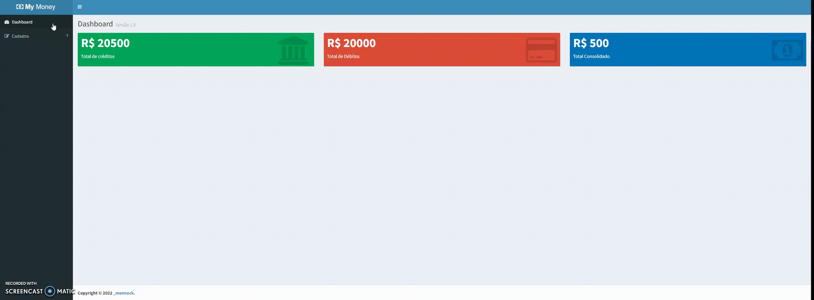

<h1 align="center">
  
</h1>

## 🚀 Tecnologias

---

Esse projeto foi desenvolvido com as seguintes tecnologias:

- ReactJS
- Bootstrap

## 💻 Projeto

---

Esse projeto foi desenvolvido para aprimorar os conceitos aprendidos junto das aulas de um curso sobre React

### Rodando localmente

---

1. Instalar todos os pacotes com `npm install`
2. Executar o comando `npm run dev`
3. Em alguns seguntos a URL: `http://localhost:8080/` ficará disponível